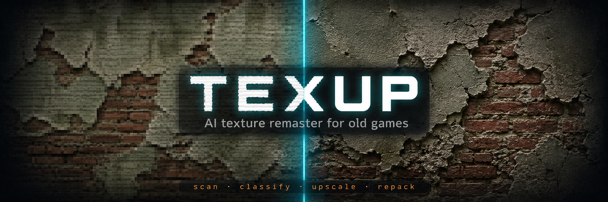

<p align="center">
  
</p>

# texup

**One-command AI texture remaster for old games.** Point it at a game folder — it finds every texture, figures out what each one is, upscales it with the right neural model, and packs everything back exactly the way the game expects. Locally, on your machine, with full backup and rollback.

[](https://www.python.org/)
[](https://pytorch.org/)
[](https://openmodeldb.info/)
[](LICENSE)
[]()

The goal is a *respectful* remaster: sharper, more detailed textures that keep the original art style — not a generative repaint of the game.

## How it works

```
game folder ──► scan ──► classify ──► route ──► upscale ──► re-encode ──► output folder
                 │          │           │          │            │
              codecs     diffuse?    per-class   tiled fp16   same format,
             (DDS, TEX,  normal?     AI model    inference    same mips,
              ARC, PNG)  UI? font?   selection   on GPU       same layout
```

1. **Scan** — walks the game folder, decodes every texture it recognizes, including textures packed inside game archives.
2. **Classify** — filename patterns, color statistics and compression format decide whether each texture is diffuse, a normal map, a material mask, UI, or a font atlas.
3. **Route** — each class gets its own treatment: a detail-restoring GAN for diffuse, a normal-map-specific model (with the game's channel swizzle handled), classic filtering for font atlases — neural nets make text worse, not better.
4. **Upscale** — tiled inference with fp16 on Apple Silicon (MPS) or CUDA, automatic OOM fallback, alpha handled separately.
5. **Re-encode** — same compression family, regenerated mip chains, byte-faithful container layout. If the game had a DXT5 texture in a zlib archive, it gets a DXT5 texture in a zlib archive back.
6. **Apply / rollback** — results go to an output folder first. `apply` copies them into the game with originals backed up; `rollback` restores everything.

## Quick start

```bash
git clone git@github.com:veryCoolTimo/texture-auto-upscaler.git
cd texture-auto-upscaler
python3 -m venv .venv && .venv/bin/pip install -e .

# 1. scan the game
.venv/bin/texup scan "/path/to/GameFolder" --out ./out

# 2. try a sample first: 5 textures per class + before/after sheets
.venv/bin/texup upscale ./out --sample 5 --compare
open ./out/_compare

# 3. happy? run the whole thing (resumable — Ctrl+C safe)
.venv/bin/texup upscale ./out

# 4. into the game (originals backed up automatically)
.venv/bin/texup apply ./out

# changed your mind?
.venv/bin/texup rollback "/path/to/GameFolder"
```

Models download automatically on first use (~130 MB) into `~/.cache/texup/models/`.

## What it supports

| Layer | Support |
|---|---|
| Image formats | PNG, JPG, TGA, BMP, DDS (BC1/DXT1, BC2/DXT3, BC3/DXT5, BC5, uncompressed) |
| Game engines | MT Framework (Resident Evil 5): `.tex` textures + `.arc` archives, byte-identical repack |
| Texture classes | diffuse / albedo, normal maps (incl. DXT5nm AG-swizzle), material masks, UI, font atlases |
| Hardware | Apple Silicon (MPS, fp16), NVIDIA (CUDA), CPU fallback |
| Models | anything [spandrel](https://github.com/chaiNNer-org/spandrel) loads — the registry ships Remacri, Real-ESRGAN x4plus and a BC-aware normal-map model |

Codecs are plugins: a new engine is one file implementing `detect / decode / encode_file`. The MT Framework codec was reverse-engineered and verified against every file of a real installation — 645/645 loose textures parse byte-exact, 1231/1232 archives repack byte-identical.

## Built for real scale

A real 2009 game is ~36,000 textures. Naively that's a day and a half of GPU time. texup gets it down to a few hours:

| Optimization | Effect |
|---|---|
| Content dedupe cache | 59% of the test game's textures were exact copies packed into multiple archives — each unique texture is upscaled once |
| fp16 inference on MPS | ~2x, with automatic fp32 fallback if the model misbehaves |
| CPU ‖ GPU pipeline | archive re-encoding overlaps with inference of the next texture |
| Small-texture batching | icons and masks ride through the GPU in packs, not one by one |
| Resume | the manifest journals every texture; interrupt and continue any time |

## Choosing the look

`--compare` writes side-by-side sheets so you decide with your eyes, not metrics. The default diffuse model is [Remacri](https://openmodeldb.info/models/4x-foolhardy-Remacri) — the community favourite for texture packs: it *restores* surface detail (fabric weave, rust grain) instead of just sharpening. Swap models per class in `texup/router.py` — anything from [OpenModelDB](https://openmodeldb.info/) works.

## Roadmap

- More engine codecs (Source VPK, Bethesda BSA, ZIP-based paks)
- Diffusion "hero mode" — one-step diffusion SR (AdcSR-class) for handpicked environment textures
- Cubemap support for MT Framework
- GUI wrapper

## Fair use

texup is a modding tool. Use it on game copies you own; don't redistribute processed game assets — share the tool, not the textures.

## License

[MIT](LICENSE)
